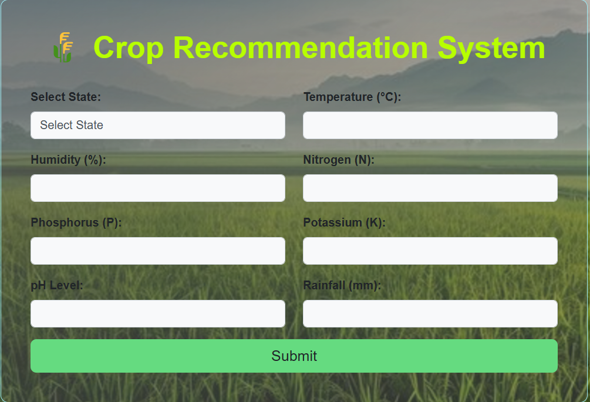
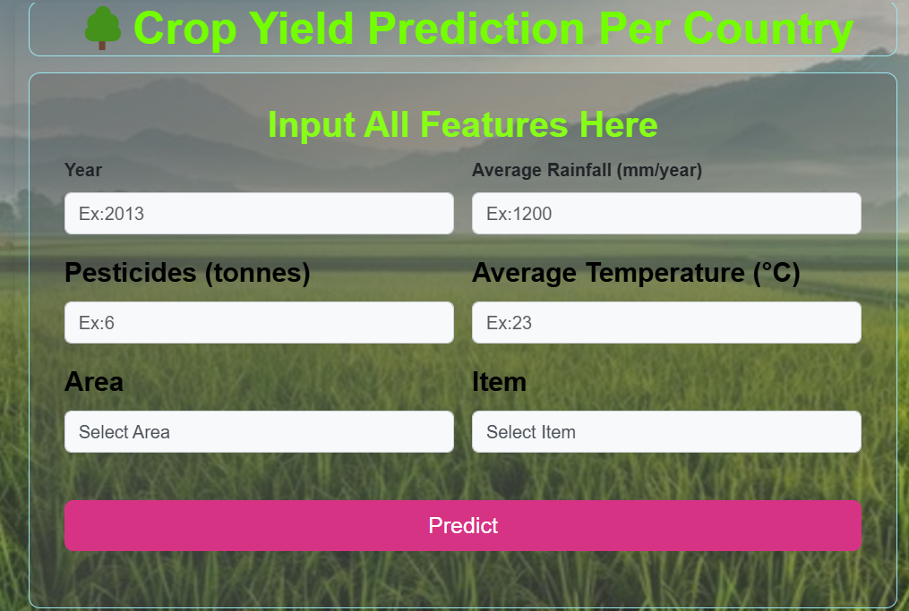

# 🌾 AgroVision - Smart Agriculture Assistant

AgroVision is a Flask-based web application designed to assist farmers with crop recommendation, yield prediction, fertilizer suggestion, and more — all powered by trained machine learning models.

---

## 📸 Demo Screenshots

> 🖼️ Place your screenshots or UI images in the `static/images/` folder and update the paths below.

- **Crop Recommendation**  
  

- **Yield Prediction**  
  

---

## 🚀 Features

- 🌱 **Crop Recommendation** based on soil nutrients, temperature, humidity, pH, and rainfall.
- 📊 **Crop Yield Prediction** using past agricultural and environmental data.
- 💧 **Fertilizer Recommendation** using classification and regression models.
- 🔒 **User Authentication** – Signup, Login, Forgot/Change Password.
- 📧 **Email-based Password Reset** functionality.
- 🌐 Clean and responsive UI built with HTML, CSS, and Flask.

---

## 🔬 Machine Learning

AgroVision integrates trained machine learning models to make data-driven decisions:

### 1. **Crop Recommendation**
- **Model**: Random Forest Classifier
- **Input Features**: Nitrogen, Phosphorus, Potassium, Temperature, Humidity, pH, Rainfall
- **Output**: Suggested crop (e.g., rice, cotton, maize, etc.)
- **File**: `model.pkl`

### 2. **Crop Yield Prediction**
- **Model**: Decision Tree Regressor (or other)
- **Input Features**: Crop type, Area, Temperature, Rainfall
- **Output**: Estimated yield per hectare
- **File**: `dtr.pkl`

### 3. **Fertilizer Suggestion**
- **Models**:
  - Classification (`fertilizer.pkl`)
  - Regression (`classifier.pkl`)
- **Input Features**: Crop type, soil nutrients, and other environmental features
- **Output**: Best-suited fertilizer recommendation

### 4. **Preprocessing Pipelines**
- Models are paired with pre-trained scalers:
  - `standscaler.pkl` (StandardScaler)
  - `minmaxscaler.pkl` (MinMaxScaler)
  - `preprocesser.pkl` (any additional transformations)

---

## ⚙️ Technologies Used

- **Python** with Flask
- **ML Libraries**: scikit-learn, NumPy, Pandas
- **Database**: SQLite3
- **Frontend**: HTML, CSS, Bootstrap (optional)
- **Email**: smtplib for password reset
- **Tools**: Git, GitHub

